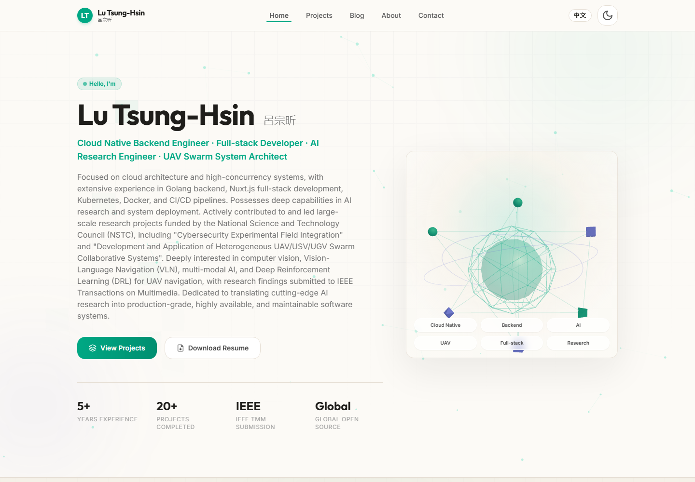
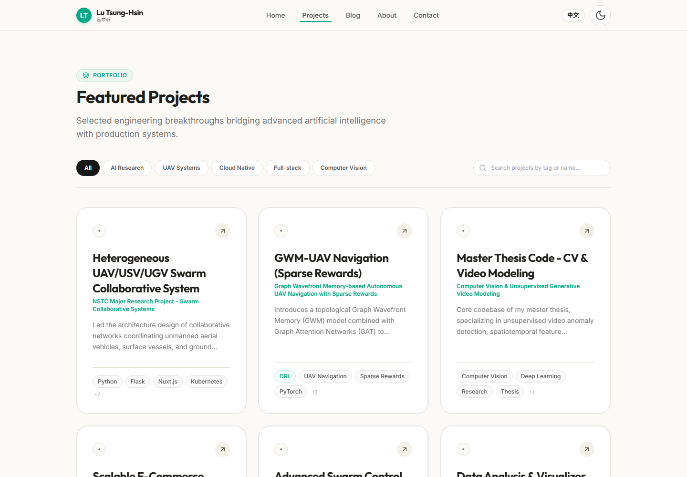
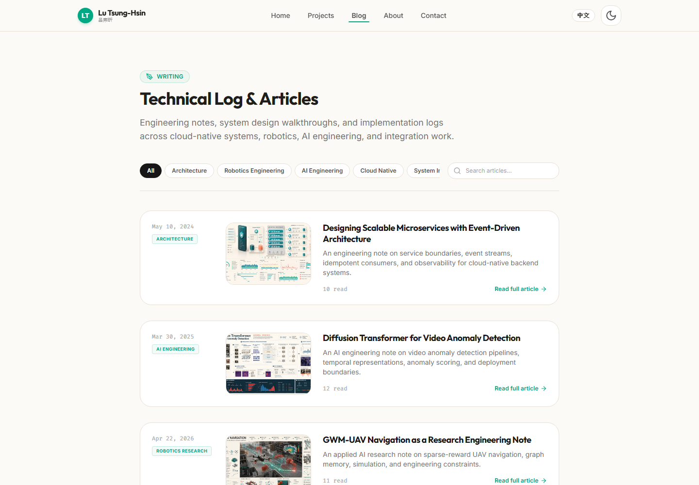
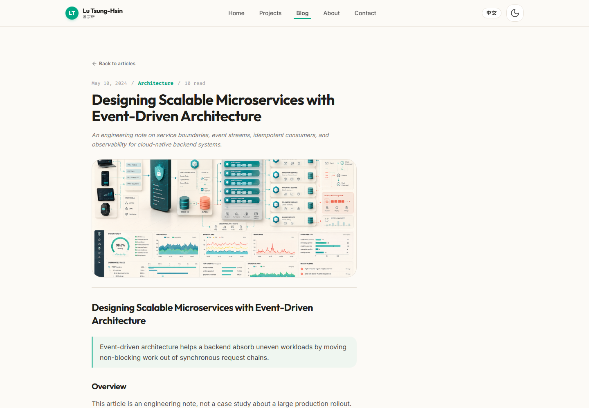
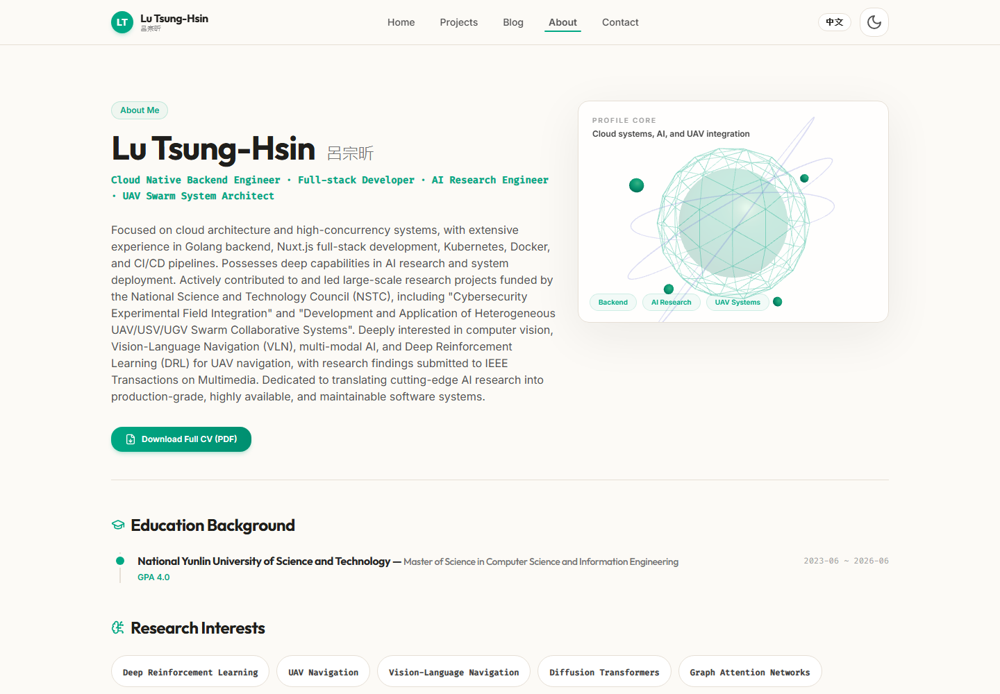
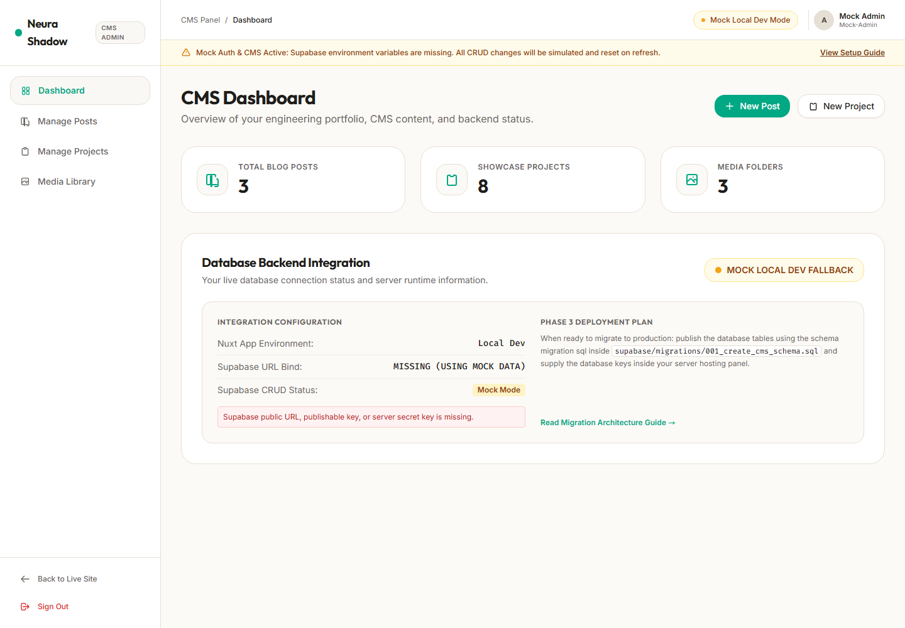
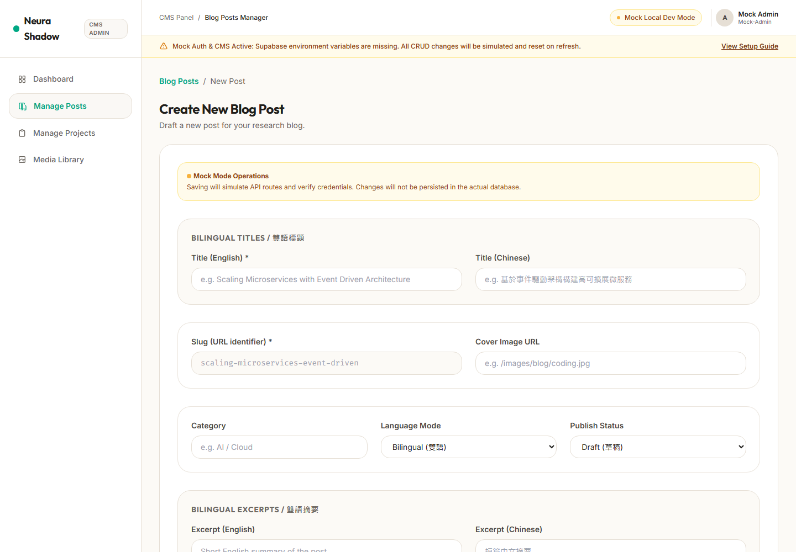

# Neura-Shadow Portfolio CMS

## Overview

Neura-Shadow Portfolio CMS is a Nuxt 3 personal portfolio, engineering blog, project showcase, and Supabase-ready content management system.

It is built to present cloud-native backend work, full-stack development, AI engineering, UAV and robotics research engineering projects, and long-form technical writing in a warm, readable, bilingual portfolio experience.

The application keeps a safe local Mock Mode for development and a Supabase Production Mode path for live Auth, PostgreSQL CRUD, and Storage-backed media management.

## Features

- Nuxt 3, Vue 3, TypeScript, Tailwind CSS, and Pinia.
- Warm light premium portfolio UI with responsive layouts.
- English and Traditional Chinese language switch.
- Project showcase with featured work, tags, stack metadata, and detail pages.
- Engineering blog articles with cover images, categories, reading time, and article pages.
- Markdown and Nuxt Content fallback for static blog content.
- Supabase-ready Admin CMS for posts, projects, and media assets.
- Mock Mode and Production Mode separation for safe local development.
- Supabase Auth production flow with private admin email allowlist.
- Server API routes for Posts, Projects, Media, and CMS health checks.
- Supabase migrations for PostgreSQL tables, grants, and RLS policies.
- Blog cover images served from `public/images/blog`.
- Three.js interactive hero and profile visuals.
- 3D tilt cards, animated backgrounds, and Inspira-style UI components.
- SEO metadata configured through Nuxt app head.
- i18n fallback behavior for bilingual content fields.

## Tech Stack

### Frontend

- Nuxt 3
- Vue 3
- TypeScript
- Tailwind CSS
- Pinia
- VueUse
- Lucide Vue icons

### Content

- Nuxt Content
- Markdown frontmatter
- Bilingual title, description, category, and content fields
- Static fallback data for blog and projects

### Backend / CMS

- Supabase
- Supabase Auth
- Supabase Storage
- PostgreSQL
- Nuxt server API routes
- Email allowlist based admin authorization
- Mock Mode fallback when Supabase env vars are missing

### UI / Interaction

- Inspira-style animated grid and particles
- Three.js hero architecture map
- Three.js profile orb and technical constellation
- 3D tilt cards
- Warm light design system with teal accents

### Quality

- TypeScript-first project structure
- Build verification through `npm run build`
- RuntimeConfig separation for public and server-only Supabase keys
- i18n fallback for missing localized fields
- Article claim safety and IEEE wording guard

## Screenshots

### Home / Hero



### Projects



### Blog



### Blog Article



### About / Profile



### Admin CMS



### Admin Editor



## Project Structure

```text
.
├── assets/
│   ├── css/
│   └── pic/
├── components/
│   ├── admin/
│   ├── inspira/
│   ├── project/
│   ├── sections/
│   ├── three/
│   └── ui/
├── composables/
├── content/
│   └── blog/
├── data/
├── docs/
├── i18n/
├── middleware/
├── pages/
│   ├── admin/
│   ├── blog/
│   └── projects/
├── public/
│   └── images/
│       ├── blog/
│       └── screenshots/
├── server/
│   ├── api/
│   └── utils/
├── supabase/
│   └── migrations/
└── utils/
```

## Local Development

Install dependencies:

```bash
npm install
```

Start the Nuxt development server:

```bash
npm run dev
```

Build for production:

```bash
npm run build
```

Generate a static build:

```bash
npm run generate
```

## Environment Variables

Copy `.env.example` to `.env` and fill in your own Supabase values when you want Production Mode:

```bash
NUXT_PUBLIC_SUPABASE_URL=https://your-project-id.supabase.co
NUXT_PUBLIC_SUPABASE_PUBLISHABLE_KEY=your-publishable-or-anon-key
SUPABASE_SECRET_KEY=your-service-role-or-secret-key
NUXT_ADMIN_EMAILS=admin@example.com
```

Security notes:

- `NUXT_PUBLIC_SUPABASE_URL` and `NUXT_PUBLIC_SUPABASE_PUBLISHABLE_KEY` are client-safe public config values.
- `SUPABASE_SECRET_KEY` is server-only and must never be exposed to browser code.
- `NUXT_ADMIN_EMAILS` is a private comma-separated allowlist used by server API authorization.
- If Supabase env vars are missing, the app stays in Mock Mode instead of crashing.

## Admin CMS

Admin routes live under `/admin`:

- `/admin/login`
- `/admin`
- `/admin/posts`
- `/admin/posts/new`
- `/admin/posts/:id/edit`
- `/admin/projects`
- `/admin/projects/new`
- `/admin/projects/:id/edit`
- `/admin/media`

Mock Mode uses local development credentials for UI testing only:

```text
admin@local.dev
local-admin-demo
```

Production Mode uses Supabase Auth and sends a Bearer token to admin-only API routes. The server verifies the Supabase session and checks the user email against `NUXT_ADMIN_EMAILS`.

## Supabase Integration

The CMS is designed around three core tables:

- `posts`
- `projects`
- `media_assets`

The migration files live in `supabase/migrations/`:

- `001_create_cms_schema.sql`
- `002_fix_grants_and_admin_policies.sql`

Production data writes use the server-side Supabase client and `SUPABASE_SECRET_KEY`. Anonymous clients can read public content but cannot write posts, projects, or media metadata.

## Content Workflow

Blog content currently supports two data paths:

- Production Mode: published posts are read through `/api/posts`.
- Mock Mode: blog content falls back to Markdown/Nuxt Content and local mock mapping.

Project content follows the same pattern:

- Production Mode: projects are read through `/api/projects`.
- Mock Mode: projects fall back to `data/projects.ts`.

The Markdown-to-Supabase migration guide is available at:

```text
docs/markdown-to-supabase-migration.md
```

## Blog Articles

Current engineering articles:

- `designing-scalable-microservices-with-event-driven-architecture.md`
- `gwm-uav-navigation-sparse-rewards.md`
- `diffusion-transformer-video-anomaly-detection.md`

The articles are written as engineering notes, system design walkthroughs, and research-to-system reflections. IEEE TMM references must use:

```text
Research submitted to IEEE Transactions on Multimedia
```

Do not describe the work as accepted or published unless that status is explicitly verified.

## Deployment Notes

The public portfolio can be statically generated for GitHub Pages. Admin CMS and server API routes require a server-capable deployment target such as Vercel, Netlify, Cloudflare, Render, or another Node/Nitro-compatible host.

For GitHub Pages:

```bash
npm run generate
```

For a live CMS deployment, configure the Supabase env vars in the hosting provider and run the SQL migrations in Supabase SQL Editor before using Production Mode.

## Documentation

Additional project docs:

- `docs/content-strategy.md`
- `docs/markdown-to-supabase-migration.md`
- `docs/migration-notes.md`
- `docs/supabase-phase3-plan.md`

## Status

Implemented:

- Nuxt 3 portfolio and blog
- Bilingual UI
- Warm light portfolio design
- Engineering blog article structure
- Blog cover images
- Three.js hero and profile components
- Supabase-ready Admin CMS
- Mock Mode fallback
- Supabase Auth and CRUD production path
- Supabase migration files

Recommended next steps:

- Deploy the public portfolio to GitHub Pages or a static host.
- Deploy the CMS version to a server-capable host.
- Keep Supabase secrets only in server environment settings.
- Continue migrating Markdown and project data into Supabase once production content is ready.
